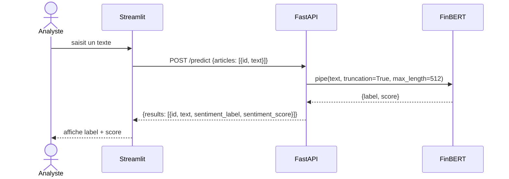

# Diagrammes de séquence — The Guardian Economic Sentiment System
 
## Flux 1 — /predict
 

```mermaid
sequenceDiagram
    actor Analyste
    participant Streamlit
    participant FastAPI
    participant FinBERT
 
    Analyste->>Streamlit: saisit un texte
    Streamlit->>FastAPI: POST /predict {articles: [{id, text}]}
    FastAPI->>FinBERT: pipe(text, truncation=True, max_length=512)
    FinBERT-->>FastAPI: {label, score}
    FastAPI-->>Streamlit: {results: [{id, text, sentiment_label, sentiment_score}]}
    Streamlit-->>Analyste: affiche label + score
```